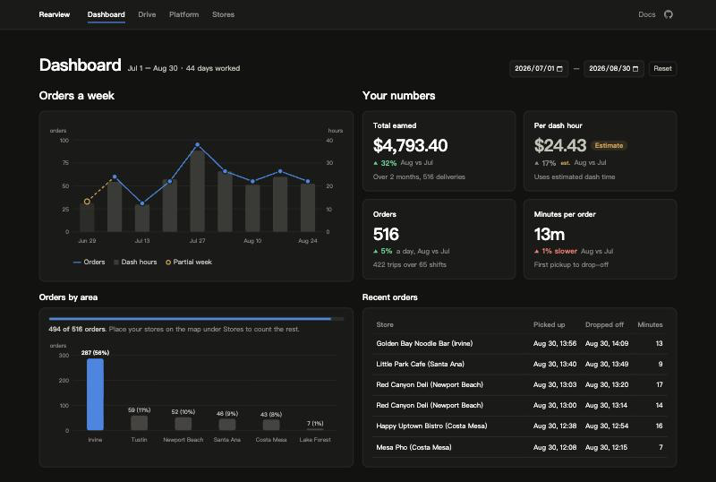

# Rearview: A Dasher's Dashboard From the Export DoorDash Already Gives You

**[Open Rearview →](https://rearview-five.vercel.app)**



**DoorDash gives merchants a dashboard. Dashers get a pay summary. Rearview reads the export from the driver's seat.**

## Why

I wanted to know how DoorDash forecasts: how much a region earns, how many orders an hour a dasher can absorb, and how it handles the uncertainty. So this summer I started dashing. A few weeks in I was more curious about my own numbers, and started building a dashboard while I kept dashing. When DoorDash [introduced Brand Center](https://about.doordash.com/en-us/news/doordash-introduces-brand-center) for merchants, I knew dashers needed one too.

Left open: the question I started with. Forecasting orders by area and hour, with the uncertainty attached.

## What my own file showed

465 deliveries over two months, summer 2026, Orange County.

| | Figure | Source |
|---|---|---|
| Pay per delivery | **$11.34** | From the file |
| Pay per dash hour | $29.55 | Estimate, runs high |
| Order time (customer wait) | **30.9 min** median | From the file |
| Repeat stores | **39%** of orders | From the file |
| Second drop on a same-store stack | **21.6 min** vs 13.6 solo | Inferred, n = 37 |

Stacking from one counter saves me time and costs the second customer eight minutes.

## Three things that would mislead

- **Hourly rates from the export alone.** It records orders, not the gaps between them, so time comes out short and rates run high. They stay labeled Estimate until real time is typed in.
- **A busy hour as demand.** It shows when I was out, not what the platform had to give.
- **Months by their totals.** The export starts and ends mid month, so order counts are compared per day worked.

## Notes on the design

- **Every figure says where it comes from**: from your file, inferred by a rule, or estimated.
- **A shift is my rule, not DoorDash's**: a gap over an hour starts a new one.

## Using it

Read in your browser, never uploaded. Store lookups use Google Maps, with your own key. The **Docs** tab defines every term. No export? Choose **Try with sample data**. A number looks wrong? [Open an issue](https://github.com/ShengPeiWilliam/minutes-per-order/issues).

## Repository

The metric definitions. The interface is not included.

```
code/
  data/
    csv.js, validate.js, time.js   reading the export: four columns, rejected rows, UTC to local time
    groups.js                      trips: orders whose pickup-to-drop spans overlap
    shifts.js                      the one-hour rule, and the waiting between trips
    orders.js, samples.js          per-order times, and which orders each median counts
  metrics/
    timing.js                      order time, before pickup, pickup to door
    volume.js                      repeat stores
    earnings.js                    dash time and active time, estimated and calibrated
    stats.js                       median and percentages
```
